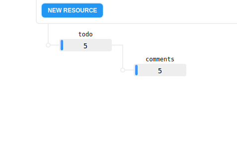
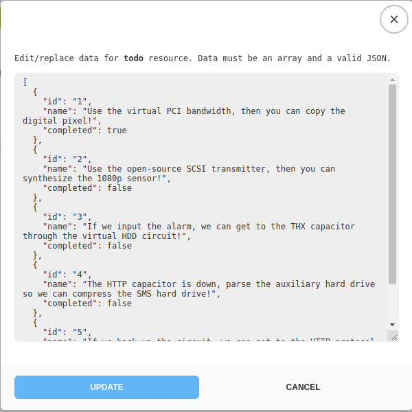
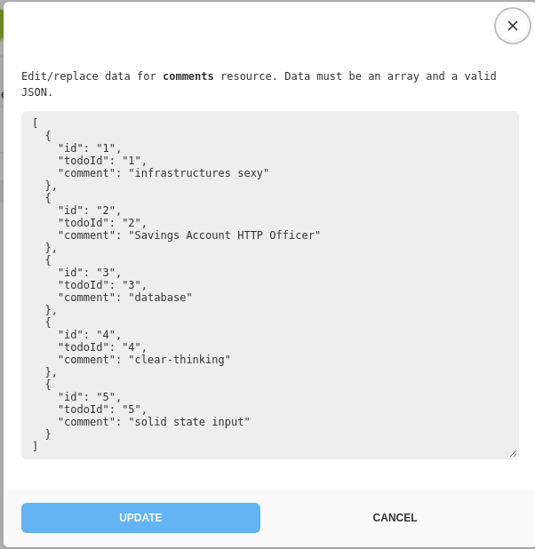

# PyCap-TODO-EXTERNAL-API

Capstone example of applying the learnings from PyCap intro to Python

## Problem

Create a commandline application using Python 3.6+ that allows you to todo list on an extrnal API.
Your code should be well documented with a docstrings, comments and a README describing how your program works, unit tests to ensure it works as expected, type annotations
to allow other developers to understand how to help build upon your program and finally well formatted code (using Black).

You should add a summary to your README that includes the next steps (dot points) and also the strengths and weaknesses of your program in its current state.
A list of operations that your should support, as well as how we expect them to be called can be found in the table below.

| Operation                                            | Usage | Required |
|------------------------------------------------------|-------|----------|
| Add a todo                                         | `python api.py add-task --name "What is up" --comment "Here we are again"`      | TRUE     |
| Read all todos                               | `python api.py list-all`      | TRUE     |
| Read todos with filtering                               | `python api.py list-all --id "1" --name "Get the dog" --completed False --comment "Too hard" --limit "3"`      | TRUE     |
| Update task | `python api.py update-task --name "Get going" --complete True --comment "Tough job"`      | TRUE     |
| Delete task               | `python api.py delete-task --id "1"`      | TRUE     |
| Mark task as done          | `python api.py mark-as-done --id "1"`      | TRUE     |

## About the API you will use

For this excercise, you will be given an address to an API endpoint on [mockapi.io](www.mockapi.io). The data is in form of a todo list and has the fields **id**, **name**, **completed** and **comments**. However, the comments are in a nested list:

Every todo item in the first **todo** list, is linked to only one other item in the **comments** list through the **id** field. (ergo the idea of the nested list). A part of the challenge is to find out a good way to handle this nested nature of data structure in your interaction with the API. i.e. represent a task with all its fields when you make a query to the API even though the comment field is in a separate list.

## Limitaions of the API

Another part of the challenge is to be mindful of the limitations of the [mockapi.io](www.mockapi.io) API provided to you. They include:
- Mockapi allows you to make 15 requests within 20 seconds.
- Multi-search parameters are not yet supported. I recommend looking up mockapi's short documentation regarding available searching methods.

## Optional Extras

- Representing responses from API in a pretty json format or using [tabulate](https://pypi.org/project/tabulate/) to represent them as lovely tables.
- Incorporate ascii art into visualising your responses.
- Visualize the todo list using ascii art
- Use different colors for the completion state of the task items
- Can you find a way to make the code faster? (i.e. using http.cookiejar module and sessions, using concurrency etc)
